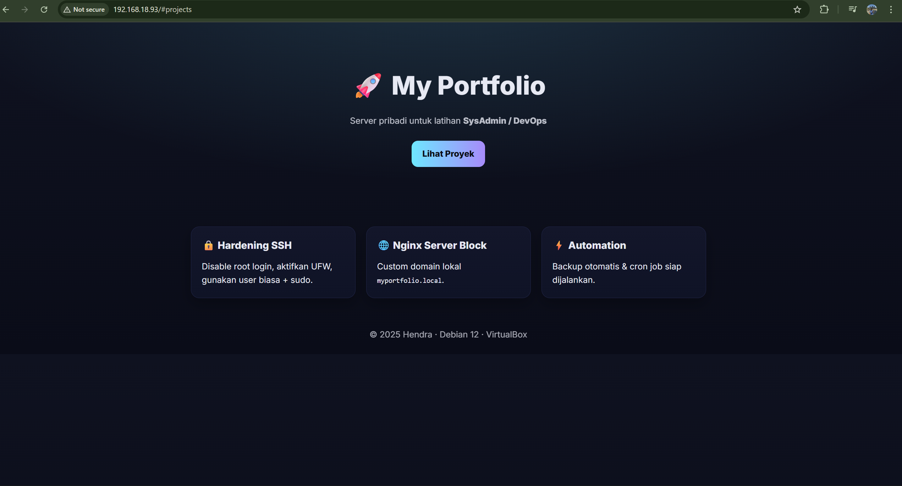

# 🚀 My Portfolio

Portfolio site with **Debian + Nginx** (Virtual Machine Project).  
Project ini dibuat sebagai latihan SysAdmin / DevOps dasar.



---

## ✨ Features
- 🔐 Hardening SSH (disable root login, aktifkan UFW, gunakan user biasa + sudo)
- 🌐 Nginx Server Block dengan domain lokal `myportfolio.local`
- ⚡ Automation: siap cron job & backup otomatis
- 📦 Website statis dengan HTML + CSS modern (Grid + Card)

---

## 🛠 Tech Stack
- Debian 12
- Nginx
- UFW Firewall
- Git & GitHub
- VirtualBox

---

## 🚀 How to Run
1. Clone repo ini:
   ```bash
   git clone https://github.com/Henddraal29/myportfolio-site.git
